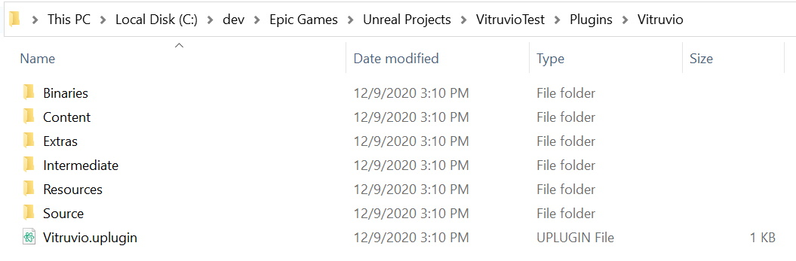

# Installation

This page describes how to install the Vitruvio Plugin for Unreal 4.26.

* Download the [latest Vitruvio](https://github.com/Esri/vitruvio/releases/latest) version. **Note** that the zip file contains libraries which are used by Vitruvio and your browser might warn you not to download them. This warning can be ignored.

* Create a new Unreal Engine 4.26 project from the Epic Games launcher or use an existing project.

* Create a folder named `Plugins` in the root directory of your project if it does not already exist (for example `C:\dev\Epic Games\Unreal Projects\VitruvioTest\Plugins`).
  
* Unzip the previously downloaded file to the `Plugins` folder. The `Plugins` folder should now contain a `Vitruvio` folder (containing the Plugin) looking like this:
  
  
  
* Open the project. The Vitruvio plugin will be enabled automatically and can be used. For further instructions on how to use the Plugin please refer to the [Usage Guide](usage.md).
  
  
  
  
  
  
  
  
  

