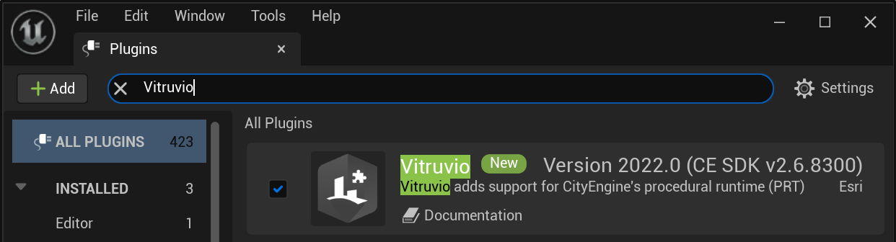

# Vitruvio Installation

This page describes how to install and setup the Vitruvio Plugin for Unreal Engine.

## Download and Install

* Download the MSI installer of the [latest Vitruvio](https://github.com/Esri/vitruvio/releases/latest) version (alternatively the plugin can also be downloaded as a zip file and extracted directly into your Unreal Engine project). **Note** that the installer contains libraries which are used by Vitruvio and your browser might warn you not to download them. This warning can be ignored.

* Follow the instructions of the installer.

## Plugin Activation

* Create a new Unreal Engine project from the Epic Games launcher or open an existing project.

* After opening the project a popup will notify you of the newly available Vitruvio Plugin. Open **Manage Plugins...** (if the popup does not appear open **Edit** &rarr; **Plugins** instead)
  
  

* Search for *Vitruvio* in the Plugin manager and enable the plugin (will require a restart).
  
  

* Vitruvio will be ready to use after Unreal has restarted. For further instructions on how to use the Plugin please refer to the [Usage Guide](usage.md).
