# Usage

ArcGIS CityEngine for Unreal leverages CityEngine's Procedural Runtime (PRT) to generate buildings. As input it takes a _rule package (RPK)_, an _initial shape_ and a _set of attributes_. The generation process starts with the initial shape as start shape, from which shape grammar rules are expanded. The attributes are parameters that control shape generation.

**Note** that the internal name of the Plugin is _Vitruvio_ and therefore all Actors, Components and Functions are referenced by this name.

**Note** the plugin contains a demo folder with an example level. First, enable _Show Engine Content_ and _Show Plugin Content_ in the View Options (bottom right) of the Content Browser. The demo content can now be found in the _Vitruvio Content/Demo/_ folder.

This section describes how to use the Vitruvio Actor in Unreal Engine 5 (UE5), export rule packages from CityEngine and how to import or create initial shapes.

## Vitruvio Actor and Component

The _Vitruvio Component_ allows the user to access the procedural generation. It can be attached to any Unreal Actor. If the Actor already has a valid initial shape component attached it will automatically be used as the initial shape for the building generation. Refer to [Initial Shapes](#Initial-Shapes) for more information.

For ease of use the Vitruvio plugin also provides the _Vitruvio Actor_ which can be found in the _Place Actors_ Panel and placed anywhere in the scene.

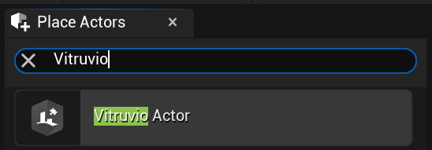

After placing the Vitruvio Actor in the scene the _Details_ panel shows all relevant properties.

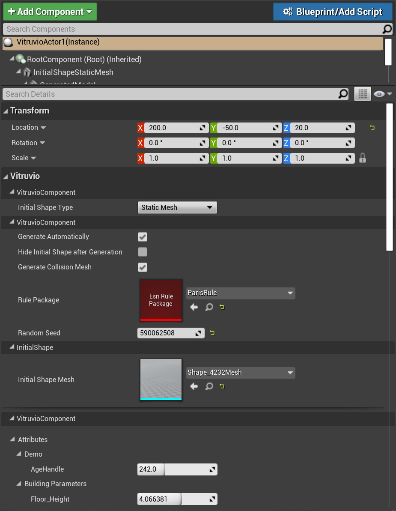

**Generate Automatically:** Whether to generate automatically after changes to properties such as the initial shape, rule package or attributes.

**Hide Initial Shape after Generation:** Whether to hide the initial shape geometry after a model has been generated.

**Generate Collision Mesh:** Whether to generate a collision mesh (complex collision) after the generation.

**Rule Package:** The rule package to be used. For more information on how to export rule packages from CityEngine and importing them into UE5 see [Rule Packages](#Rule-Packages).

**Random Seed:** The random seed to be used for generation. See also [CityEngine Help](https://doc.arcgis.com/en/cityengine/2019.1/help/help-working-with-rules.htm#GUID-FD7F11D4-778E-4485-901B-E11DDD2099F2).

**Reports:** The generated [CGA report](https://doc.arcgis.com/en/cityengine/latest/cga/cga-report.htm) values. These values can be accessed with the [Blueprint API](#Blueprint-Support).

**Initial Shape Type:** The type of input initial shape used. For more information on how to import or create initial shapes see [Initial Shapes](#Initial-Shapes).

**Attributes:** The attributes of the selected rule package which control the generation. See also [Attributes](#Attributes).

## Rule Packages

A [rule package](https://doc.arcgis.com/en/cityengine/2019.0/help/help-rule-package.htm) (RPK) is a compressed package, containing compiled CGA rule files, plus all needed referenced assets and data. RPKs can be exported in CityEngine by right clicking on a CGA file and using the _Share As..._ menu. Make sure to include all necessary assets in _Additional Files_ and set _Save package to file_ to the path you want to export the RPK to.

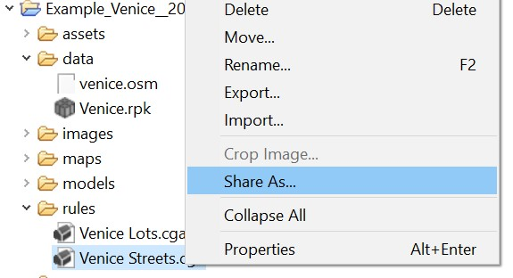

The exported RPK can then be dragged into the Unreal Editor’s _Content Browser_ which will import it into your project.

**Note** that there is currently a limit of 2GB file size for imported RPKs.

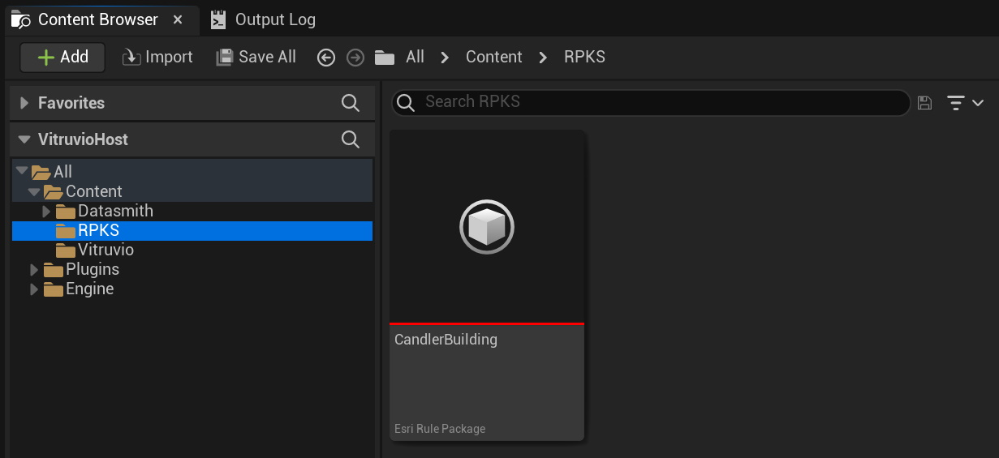

The imported RPK Asset can now be dragged on the _Rule Package_ field of a Vitruvio Actor to assign it.

## Initial Shapes

Initial shapes ([CGA modeling overview](https://doc.arcgis.com/en/cityengine/latest/help/help-cga-modeling-overview.htm)) represent the input geometry which typically are polygons that represent a lot or a building footprint. Vitruvio supports two kind of initial shapes, _Static Meshes_ and _Splines_.

### Static Mesh

To change the initial shape geometry you can assign a Static Mesh to the _Initial Shape Mesh_ field. **Note** that currently only planar geometry is supported.

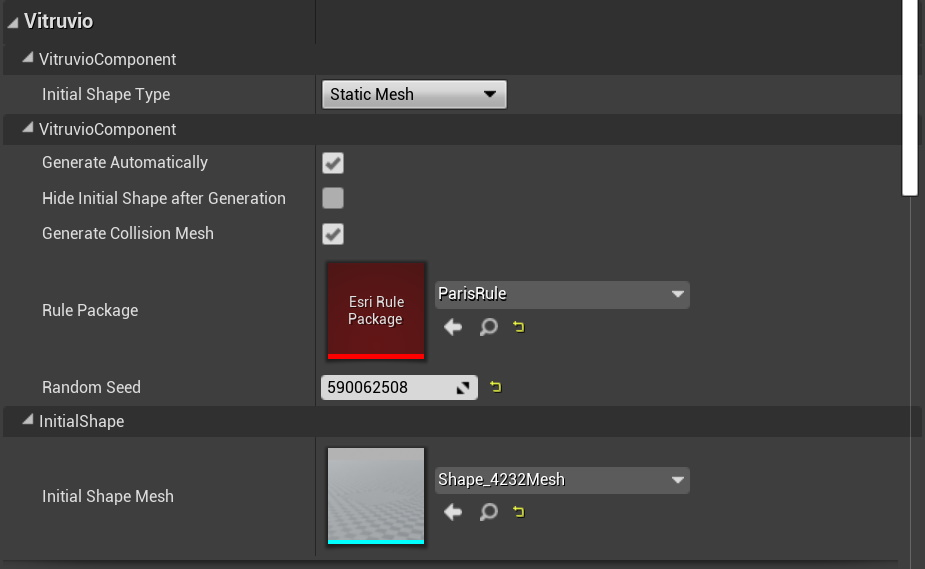

### Splines

To use a Spline as an initial shape, change the **Initial Shape Type** drop down to **Spline**.

To copy a spline point, select an existing point, press alt and drag the point. Spline points can either be linear or curved. The type of an individual point can be changed by selecting the _Spline Component_ of the _InitialShapeSpline_ and in the _Selected Points_ header of the details panel.

## Attributes

Attributes control the procedural generation of a model. The set of available attributes depends on the underlying rule of the assigned _Rule Package_.

Selecting a _Vitruvio Actor_ will display all its attributes in the details panel. The values can be changed to control the procedural generation.

**Note:** if _generate automatically_ is enabled, every attribute change will regenerate the model.

## Advanced

### Initial Shapes from CityEngine to Unreal Engine

This section explains how to export a set of building footprints from CityEngine and how to import them into Unreal to use them as initial shapes for building generation.

#### CityEngine

To export initial shape building footprints from CityEngine the [Datasmith Exporter](https://doc.arcgis.com/en/cityengine/latest/help/help-export-unreal.htm) can be used. Select the building footprints in the viewport and then choose **File** &rarr; **Export models…** to export them. Select the _Unreal Engine_ exporter and make sure to set _Export Geometry_ to **Shapes** and _Mesh Merging_ to **Per Initial Shape**. This will make sure that each footprint (without generated models) is exported individually.

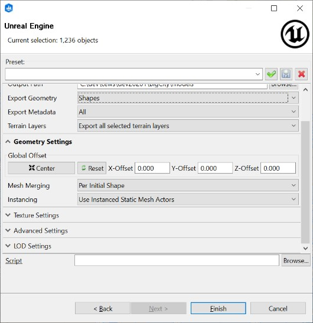

#### Unreal Engine

**Note:** To import datasmith files, the **Datasmith Importer** plugin needs to be enabled in your project. Go to **Edit** &rarr; **Plugins** and verify that the **Datasmith Importer** plugin is enabled.

First import the datasmith file from CityEngine using the **Datasmith** importer. The default import settings can be used.

Now convert all imported initial shapes to Vitruvio Actors:

1. Select the _DatasmithSceneActor_ (this is the root Actor of the Datasmith scene)
2. Right click and choose **Select All Viable Initial Shapes in Hierarchy**. This will select all child Actors which are viable initial shapes (meaning all Actors which either have a valid _StaticMeshComponent_ or _SplineComponent_ attached).

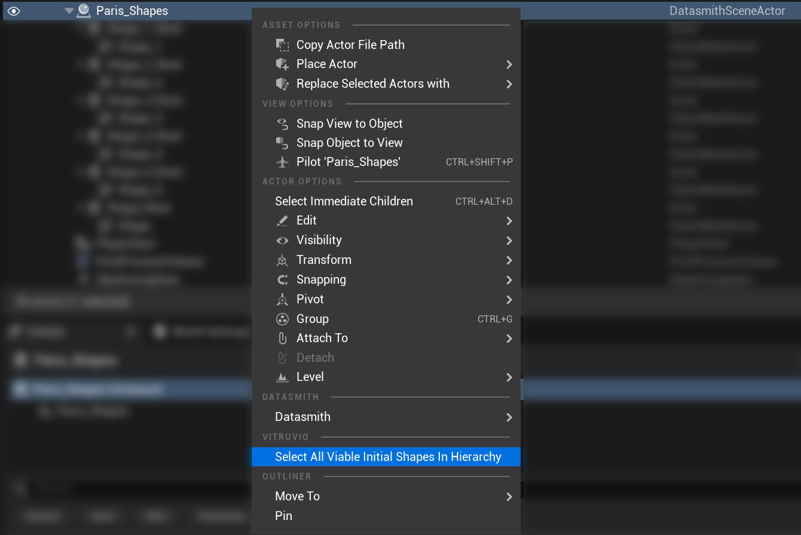

3. Right click again on any selected Actor and choose **Convert to Vitruvio Actor**. In the opened dialog, choose any RPK you want to assign. This will convert all selected Actors to Vitruvio Actors and assign the chosen RPK.

### Blueprint Support

This section explains how to use Blueprints with Vitruvio Actors. Unreal Engines' [Blueprint System](https://docs.unrealengine.com/5.0/en-US/blueprints-visual-scripting-in-unreal-engine) is a powerful visual scripting language. The VitruvioComponent provides several Blueprint functions to control its behavior, by for example setting new attribute values or accessing reports after the generation of a model.

**Note:** the _generate automatically_ flag of the VitruvioComponent is ignored for Blueprint API calls. Re-generation is controlled for each function call individually via a parameter.

#### Setup

We first need to retrieve the VitruvioComponent to get access to all neccessary functions. In the **ReportingDemo** scene (in the "VitruvioContent/Demo" folder) open the [Level Blueprint](https://docs.unrealengine.com/4.27/en-US/ProgrammingAndScripting/Blueprints/UserGuide/Types/LevelBlueprint/) and drag the _Candler Building_ Actor from the Outliner into the Blueprint to access the VitruvioComponent as follows:

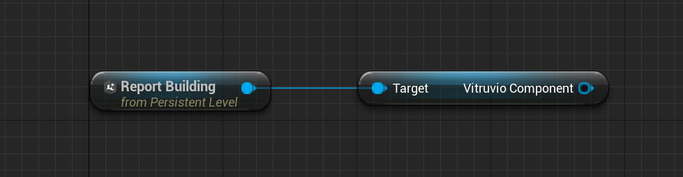

#### Modifying Attributes

Next, we modify the **nFloor** attribute of the _Report Building_ Vitruvio Actor as follows:

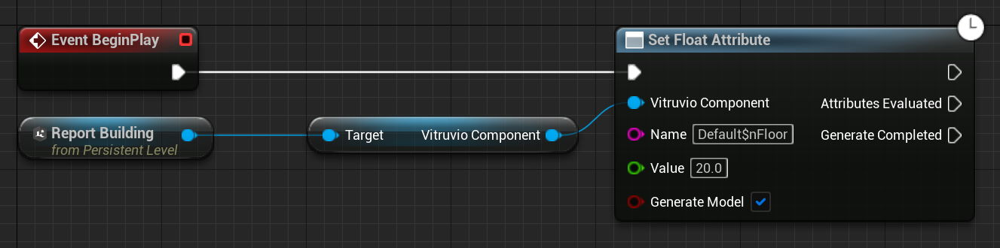

This call is executed asynchrounsly. The default execution path is executed immediately after the call has completed, _Attributes Evaluated_ is executed once the attributes have been evaluated and _Generate Completed_ is executed once the new model has been generated. If _Generate Model_ is set to false, _Generate Completed_ is never executed.

All other Vitruvio Blueprint calls follow a similar structure.

**Note:** that when multiple asynchronous Vitruvio Blueprint calls are executed simultaneously, only one _Generate Completed_ is executed.

**Note:** that the fully qualified attribute name needs to be passed. The fully qualified name includes the CGA style prefix (which is _Default\$_ for all attributes for now). You can access the name from Details panel by right clicking on an attribute and selecting **Copy Fully Qualified Attribute Name**.

#### Accessing Reports

We can now access the reports and print them as follows:

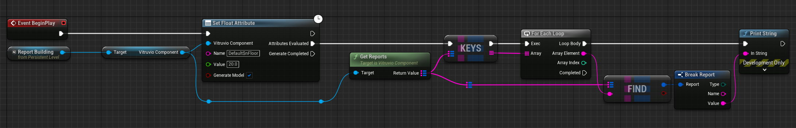

The _Attributes Evaluated_ execution path is used since we need to wait until the new attributes have been evaluated before we can access the new report values.

### Batch Generation

Batch generation allows for the simultaneous generation of several models in batches, enhancing performance.

Batch generation can be controlled per Vitruvio Actor using the _Batch Generate_ option. It is recommended to use this feature if your scene contains many Vitruvio Actors.

The advantages include shorter generation times as well as improved rendering performance. However, if a Vitruvio Actor's attributes are changed at runtime (for example, via user input), it is recommended not to allow batch generation since every attribute change requires regenerating the entire batch.

For advanced use cases the _Grid Dimension_ (which controls the batch size) on the _Vitruvio Batch Actor_ can be changed.

### Asset Replacements

Vitruvio Actors support automated asset (Materials and Instances) replacements using Data Tables.

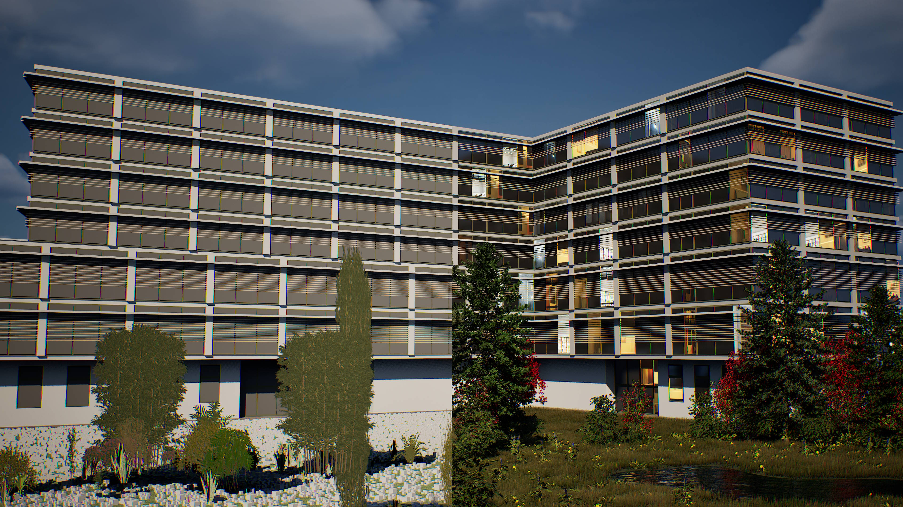

To begin the replacement workflow, select either _Replace Materials_ or _Replace Instances_ on the Vitruvio Actor. This action will prompt a dialogue where you can first select (or create) a Data Asset where the replacements are stored. **Note** that this Data Asset can also be applied to other Vitruvio Actors to implement the same replacements. Once selected, you can define the actual replacements and apply them. These replacements will now take effect after every model regeneration.
