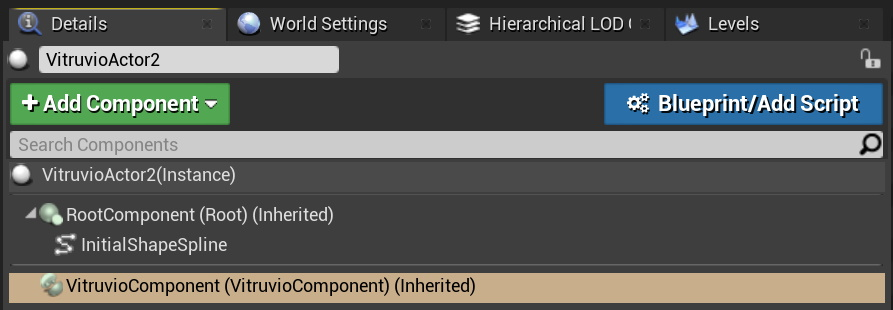

# Usage

Vitruvio leverages CityEngine's Procedural Runtime (PRT) to generate buildings. As input it takes a *rule package (RPK)*, an *initial shape* and a *set of attributes*. The generation process starts with the initial shape as start shape, from which shape grammar rules are expanded. The attributes are parameters that control shape generation.

This section describes how to use the Vitruvio Actor in UE4, export rule packages from CityEngine and how to import or create initial shapes.

## Vitruvio Component

The *Vitruvio Component* allows the user to access the procedural generation. It can be attached to any Unreal Actor. If this Actor already has a valid initial shape component attached it will automatically be used. Refer to [Initial Shapes](#Initial-Shapes) for more information.

For ease of use there is also a *Vitruvio Actor* available, which can be found in the *Place Actors* Panel and placed anywhere in the scene.

After placing the actor in the scene and selecting it, the *Details* panel shows all relevant properties.

**Initial Shape Type:** The type of input initial shape used. For more information on how to import or create initial shapes see [Initial Shapes](#Initial-Shapes).

**Rule Package:** The rule package to be used. For more information on how to export rule packages from CityEngine and importing them into UE4 see [Rule Packages](#Rule-Packages).

**Random Seed**: The random seed to be used for generation. See also [CityEngine Help](https://doc.arcgis.com/en/cityengine/2019.1/help/help-working-with-rules.htm#GUID-FD7F11D4-778E-4485-901B-E11DDD2099F2).

**Generate Automatically:** Whether to generate automatically after changes to relevant properties such as the initial shape, rule package or attributes.

**Hide after Generation:** Whether to hide the initial shape geometry after a model has been generated.

## Rule Packages

A [rule package](https://doc.arcgis.com/en/cityengine/2019.0/help/help-rule-package.htm) (RPK) is a compressed package, containing compiled CGA rule files, plus all needed referenced assets and data. RPKs can be exported in CityEngine by right clicking on a CGA file and using the *Share As...* menu. Make sure to include all necessary assets in *Additional Files* and set *Save package to file* to the path you want to export the RPK to.

The exported RPK can then be dragged into the Unreal Editor’s *Content Browser* which will import it into your project.

**Note** that there is currently a limit of 2GB file size for imported RPKs.

## Initial Shapes

Initial shapes ([CGA modeling overview](https://doc.arcgis.com/en/cityengine/latest/help/help-cga-modeling-overview.htm)) represent the input geometry which typically are polygons that represent a lot or a building footprint. Vitruvio supports two kind of initial shapes, *Static Meshes* and *Splines*.

### Static Mesh

Vitruvio supports *Static Meshes* as input initial shapes. Currently only planar Static Meshes are supported. To change the Static Mesh which represents the initial shape select the *InitialShapeStaticMesh* Component of your Actor and change the *Static Mesh*.

### Splines

Vitruvio also supports *Splines* as input initial shapes. To use a spline initial shape, change the **Initial Shape Type** drop down to **Spline**.

To copy a spline point, select an existing point, press alt and drag the point. Spline points can either be linear or curved. The type of an individual point can be changed by selecting the *Spline Component* of the *InitialShapeSpline* and in the *Selected Points* header of the details panel. For more information on how to edit splines please refer to [UE4 Spline Documentation](https://docs.unrealengine.com/en-US/Engine/BlueprintSplines/HowTo/EditSplineComponentInEditor/index.html).

### Export Initial Shapes from CityEngine

To export initial shape building footprints from CityEngine the [Datasmith Exporter](https://doc.arcgis.com/en/cityengine/latest/help/help-export-unreal.htm) can be used. Select the building footprints in the viewport and then select **File** &rarr; **Export models…** to export them. Select the *Unreal Engine* export and make sure to set *Export Geometry* to **Shapes** and *Mesh Merging* to **Per Initial Shape**. This will make sure that each footprint (with no generated models) is exported individually.

**Note:**  For the following steps, the **Datasmith Importer** Plugin needs to be enabled for the Project. Go to **Edit** &rarr; **Plugins** and verify that it is enabled.

In UE4 use the *Datasmith* importer and leave all settings as is.

To easily assign a Vitruvio Component to all imported initial shapes, select the *DatasmithSceneActor*, right click on it, choose **Select** &rarr; **Select All Viable Vitruvio Actors in Hierarchy**. This will select all child Actors which are viable for generation with Vitruvio (this means Actors which either have a *StaticMeshComponent* or *SplineComponent* attached).

After that, right click again on any selected Actor and choose *Add Vitruvio Component*. In the Dialog, choose a Rule Package you want to use. This will assign a *VitruvioComponent* to all selected Actors, with the chosen Rule Package assigned.

## Attributes

Attributes control the procedural generation of a model. The set of available attributes depends on the underlying Rule of the assigned *Rule Package*. 

To view all Attributes select the *VitruvioComponent* of the Actor

The attributes can then be changed in the Details panel. 

**Note** if generate automatically is enabled every attribute change will regenerate the model.